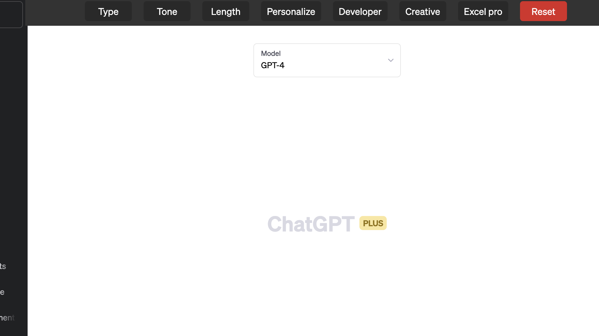

# AI tools

The tools are like weapons, they are only as good as the person using them. The tools are not a replacement for a good understanding of the any concepts.

> These tools should be used for automating the boring stuff, not for replacing the intelligence of the human.
> Also, learn in the recommendation process.

## Different AI models

### ChatGPT (by OpenAI) | Microsoft


## Tools

- [gpt4free](https://github.com/xtekky/gpt4free)
  - it uses multiple models including chatgpt. And it's for free. There are search engines based on GPT4 for free - phind, you.com, and others.
- Prompt Community: https://flowgpt.com/
  - learn prompting from the community's prompts.
- Multiple fields:
  
- [Prompt formula with different examples](https://www.linkedin.com/posts/rahulkanotra_chatgpt-activity-7052276853188796416-4vii)
- For coding in VSCode, use this extension: [AI-Genie](https://github.com/ai-genie/chatgpt-vscode)
  > Turn on billing in OpenAI website to get this extension working.
- Image generator
  - [Midjourney](https://www.midjourney.com/)
  - [Hotpot](https://hotpot.ai/)
- Video Summary:
  - [YT Summary Chrome extension](https://chrome.google.com/webstore/detail/youtube-article-summary-p/nmmicjeknamkfloonkhhcjmomieiodli/related)
- [ChatGPT for Google](https://chrome.google.com/webstore/detail/chatgpt-for-google/jgjaeacdkonaoafenlfkkkmbaopkbilf)
- [OpenAI Toolkit - AI Prompt For Social Media](https://chrome.google.com/webstore/detail/openai-toolkit-ai-prompt/acgbggfkaphffpbcljiibhfipmmpboep/related)
  

## Usage

### Coding

- Using the tool `genie` (`chatgpt-vscode`) for getting help for errors in the code. Don't forget to add billing into the OpenAI account.
- Use Copilot (currently based on Codex model) for generating the code.
- Use the AI prompt UI like `chat.openai.com` to generate the code based on prompting.
  > The GUI supports latest model, whereas the VSCode extension supports only chatgpt FREE model.

### Explanation

Use this prompt to understand visually:

```txt
Can you make the answer with emojis & diagrams?
```

<details><summary><b>Sample:</b></summary>
Absolutely, I can try to explain using emojis and diagrams. However, please note that as a text-based AI, my ability to create diagrams is quite limited.

In a Next.js server, when you get multiple API requests, they are like a queue of people (requests) 🚶‍♀️🚶‍♂️🚶‍♀️🚶‍♂️ waiting to be served.

Let's say these people are waiting for two things: a cup of coffee ☕ and a sandwich 🥪. These are like two different API endpoints.

In a normal scenario without concurrency, this would be like serving each person one by one:

1. Serve coffee ☕ to the first person 🚶‍♀️
2. Serve sandwich 🥪 to the first person 🚶‍♀️
3. Only then move to the second person 🚶‍♂️

In this scenario, every other person has to wait until the person in front of them gets both their coffee and sandwich.

With concurrency, this process changes. You start making coffee and sandwiches for everyone at the same time:

1. Start making coffee ☕ for the first person 🚶‍♀️
2. Without waiting for the coffee to finish, start making a sandwich 🥪 for the first person 🚶‍♀️
3. Without waiting for the first person's coffee or sandwich to finish, start making coffee for the second person 🚶‍♂️
4. Continue this process for everyone in the line.

In code, this would look something like this:

```javascript
const requests = urls.map((url) => fetch(url)); // Start making coffee ☕ and sandwiches 🥪 for everyone

try {
  const responses = await Promise.all(requests); // Wait for everything to finish

  const data = await Promise.all(
    responses.map((response) => response.json()) // Convert everything to a format we can serve (like putting the coffee in cups and the sandwiches on plates)
  );

  res.status(200).json(data); // Serve everything
} catch (error) {
  res.status(500).json({ error: "Something went wrong" }); // If anything goes wrong, let the user know
}
```

Please note, the maximum number of people (requests) you can serve at once depends on how many baristas (server resources) you have. If you have more people than your baristas can handle, you might need more baristas (upgraded hardware, more servers, etc.).

I hope this helps! Let me know if you have any other questions.

</details>

### Task Management

- Automate **Jira, ClickUp, Shortcut** (or any task management tool) tickets detailing. For instance, you have a title defined, and you want to generate a description for the ticket. You can use the tool (any AI model like ChatGPT) to generate the description.
  > Give more context to the prompt to get better results.


<details>
<summary><b>example prompt: </b></summary>

```txt
I need your assistance in creating and setting up Task detailing properly for a [project]

project = "A sophisticated TODO app with Blockchain integration"

I will provide you with title
Please do the following in order to give me accurate detailing:

1. user story description
2. Analyse the story and break it down to Backend, Frontend(UI), Frontend(Integration), Blockchain subtasks
3. Then give me their respective subtasks with their detailed descriptions and acceptance criteria

Here, Frontend(Integration) means the API developed in Backend tasks and UI screens built in Frontend(UI)

I need you to provide the detailing in the following order:

The format should be like this
1. User Story Description
Subtasks
1. Backend
  1.1. Task 1
      1.1.1. Description and acceptance criteria for each tasks and so on
1. Frontend(UI)
      2.1.1. Description and acceptance criteria for each tasks and so on
2. Frontend(Integration)
      3.1.1. Description and acceptance criteria for each tasks and so on
3. Blockchain
      4.1.1. Description and acceptance criteria for each tasks and so on
```

</details>

## Project Ideas


## References

- [Learn Prompting book](https://learnprompting.org/docs/basics/intro)
- [Prompt Engineering Guide](https://github.com/dair-ai/Prompt-Engineering-Guide)
