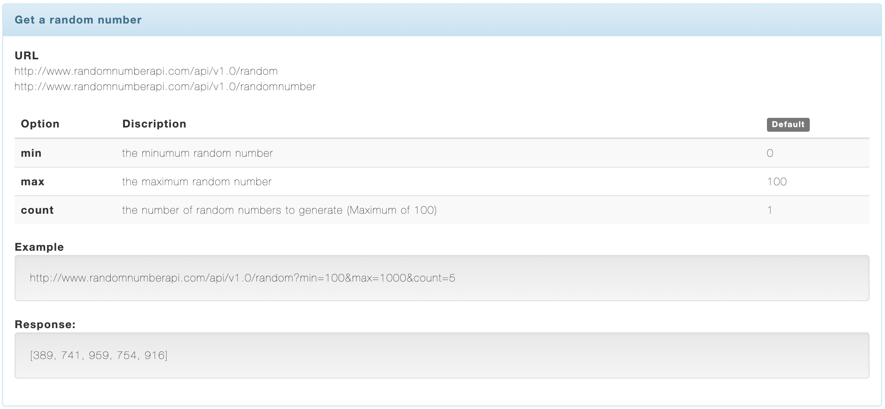
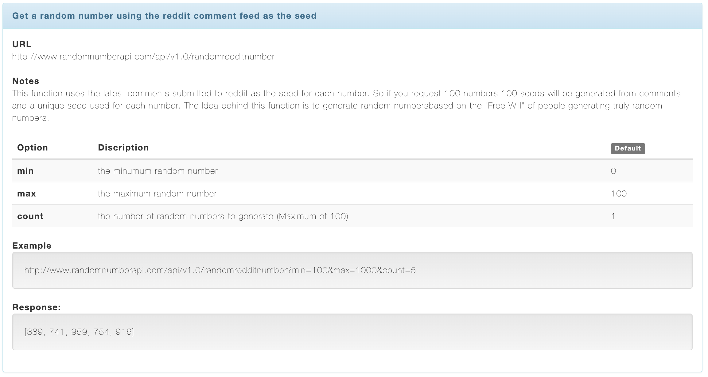
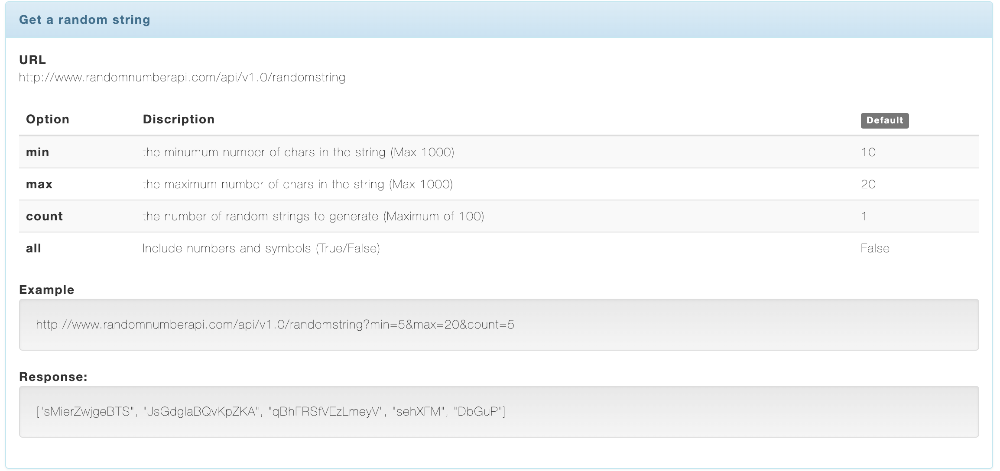
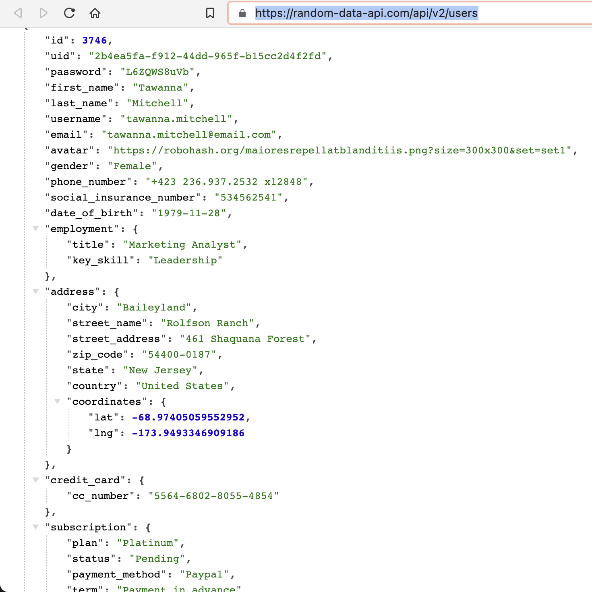
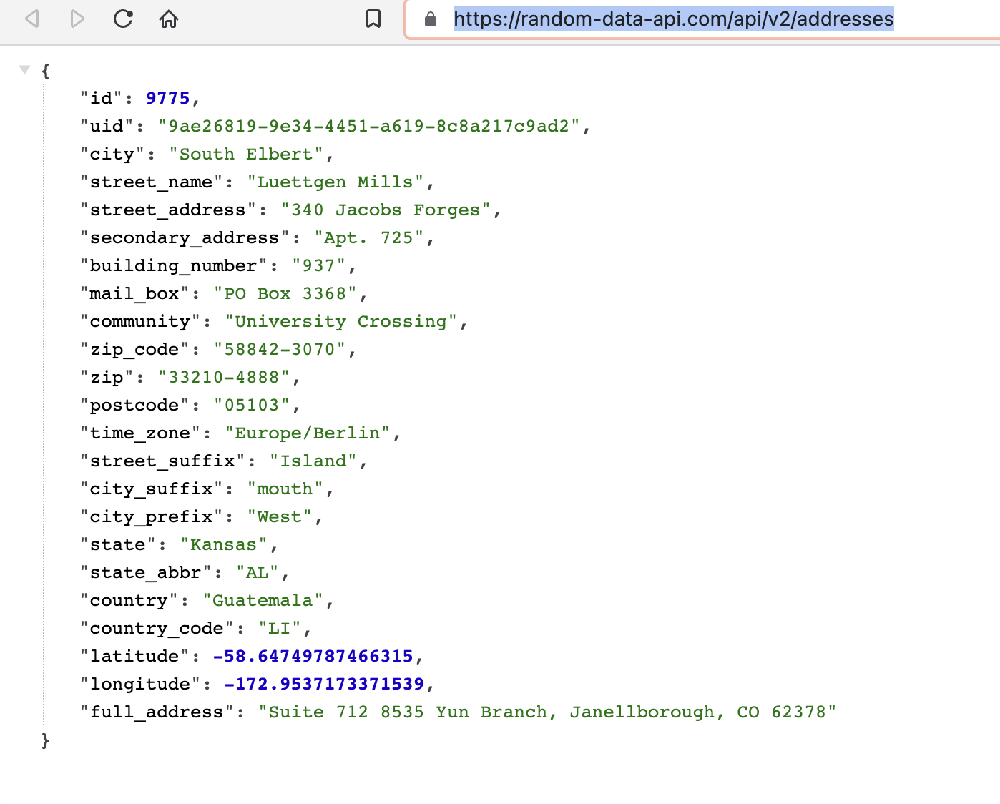
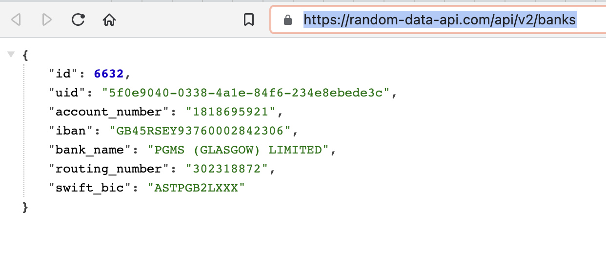
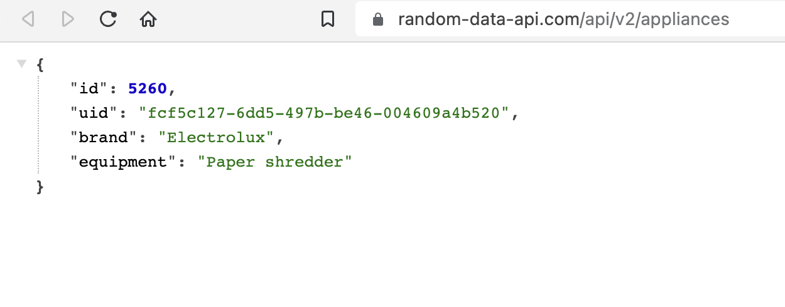
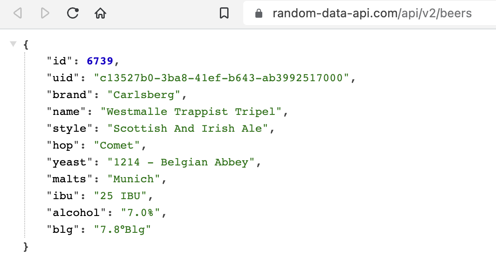
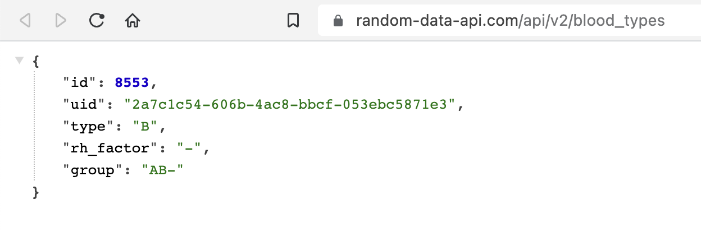
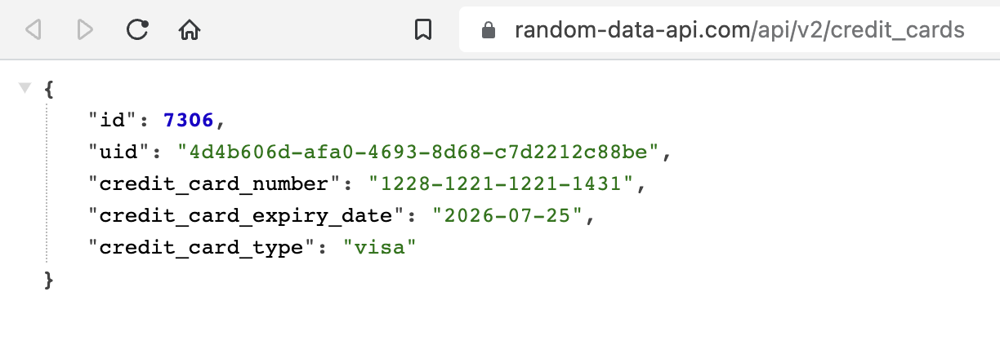

# REST API

## Overview

Here, we are not going to explain what REST API is, but we will list down the possible APIs.

## API List

- Random no. generator: https://www.randomnumberapi.com/ [NOT so reliable]

  - Get a random no
    

<kbd>View:</kbd>

    
    

  - Get a random number using the reddit comment feed as the seed
    

<kbd>View:</kbd>

    
    

  - Get a random string
    

<kbd>View:</kbd>

    
    

- Random Data API: https://random-data-api.com/api/v2/ [RECOMMENDED]

  - Get random names with details (address, cc, subscription). Mostly they are bank users.
    

<kbd>View:</kbd>

    
    

  - Get random person's address:
    

<kbd>View:</kbd>

    
    

  - Get random bank accounts with swift code
    

<kbd>View:</kbd>

    
    

  - Get random appliances - lamp, etc.
    

<kbd>View:</kbd>

    
    

  - Get random beers

    

<kbd>View:</kbd>

    
    

  - Get random blood types
    

<kbd>View:</kbd>

    
    

  - Get random credit cards
    

<kbd>View:</kbd>

    
    

