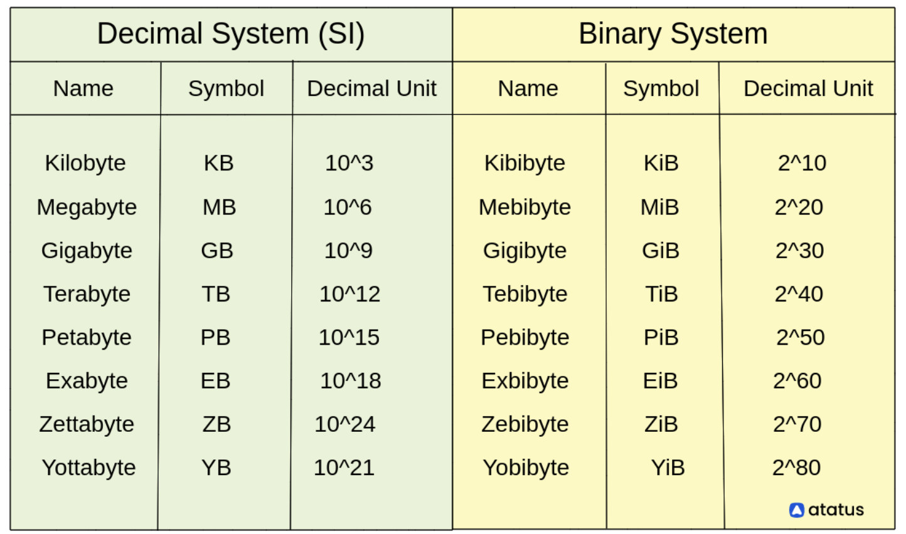

# Computer Bits & Bytes

This is about learning computer bits and bytes. It's relevant from low-level programming standpoint.

## Notes

- Decimal vs Binary system

- `2^15` maths could be computed as `1 << 15`.
