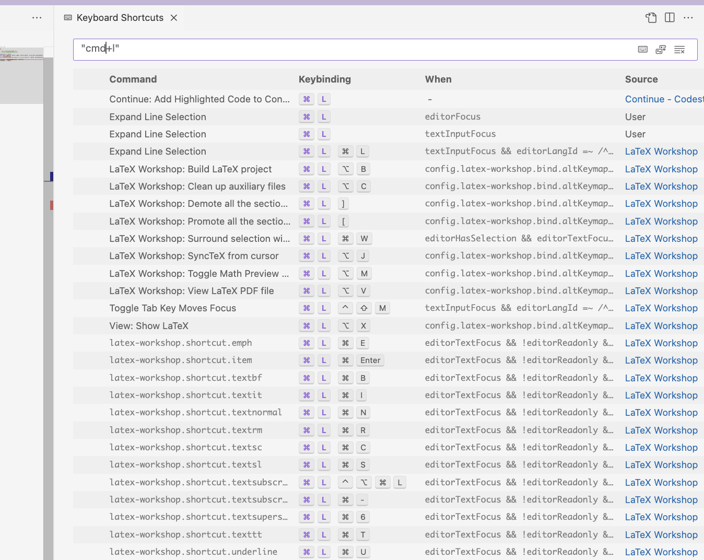

# Cursor AI

## Description

VSCode like editor with native AI code assistant.

**PAID** software.

## Installation

- Download from [here](https://www.cursor.com/).

## Setup

1. Import settings from VSCode.
2. Use <kbd>ctrl+l</kbd> to use "**Expand Line Selection**". In VSCode, it is enabled with <kbd>cmd+l</kbd> by default. Actually in Cursor editor, <kbd>cmd+l</kbd> is the shortcut key for "**Open AI chat**" on selected text.
   
