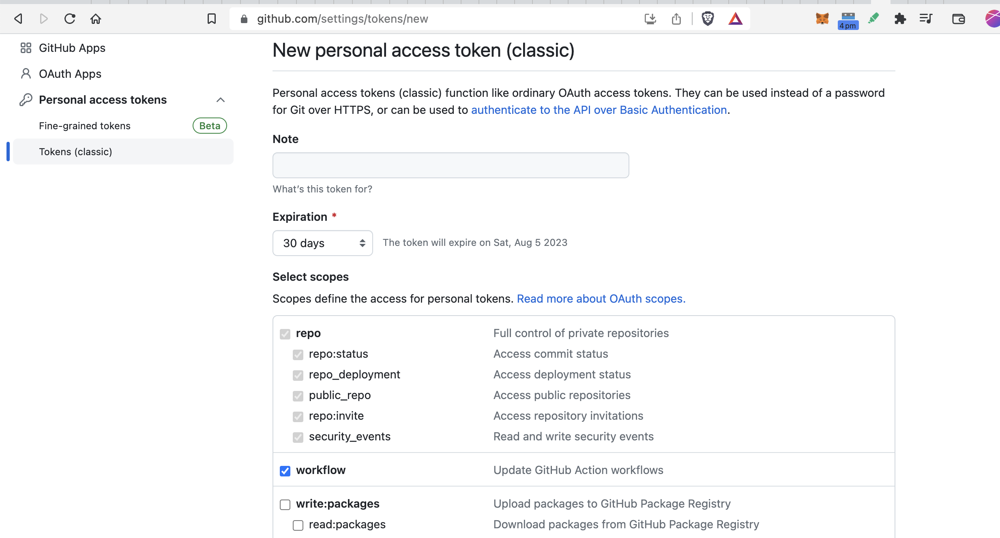
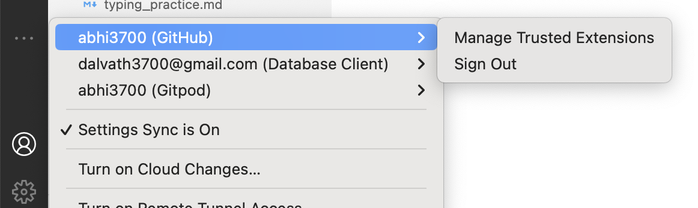

# Git & Github Essentials

## System

Windows 10
macOS (M1)

## Tools Installation

- [Git for Windows](https://git-scm.com/download/win): To use as a console (git-bash is recommended) to clone, pull, push, commit, branch, etc...
  - Add `git-bash` to system environment variables, so that it can be opened from <kbd>win+r</kbd> command & by typing `git-bash` on windows explorer to open in a specific directory.
  - Tick the option - "GitCredentialManager" during installation. This will be one-time prompt for logged-in using authentication via browser.
- [Sublime Merge](https://www.sublimemerge.com/), ✅[Git-Fork](https://git-fork.com/) - Local Git GUI and these (Github, Gitlab, Bitbucket) are used as server.

> NOTE: In macOS, to open a repo on `Fork` App, just open in terminal & type `$ fork` & then <kbd>Enter</kbd>.

## Setup multiple Github Accounts locally

This is about how to manage multiple github accounts on same device.

```
Machine: macOS M1
```

Sources:

- [1: YT Video](https://www.youtube.com/watch?v=J63meQ83yyI)
- [2: Freecodecamp Blog](https://www.freecodecamp.org/news/manage-multiple-github-accounts-the-ssh-way-2dadc30ccaca/)

Steps

> In this, `default` & `seedify` names have been used for my personal & work respectively. You can choose any name.

### 1. Generating the SSH keys using `ssh-keygen`

The SSH keys will be generated by the email address of the accounts

```sh
# In home directory
~
❯ mkdir .ssh && cd ./.ssh

# generate public/private rsa key pair for github account 1
# Your identification is saved as default
# Your public key is saved as default.pub
~/.ssh
❯ ssh-keygen -t rsa -C "da****3700@gmail.com" -f "default"

# generate public/private rsa key pair for github account 2
# Your identification is saved as seedify
# Your public key is saved as seedify.pub
~/.ssh
❯ ssh-keygen -t rsa -C "*****@seedify.fund" -f "seedify"
```

Here, instead of "default", any name can be provided like "github-personal". But, parse your original `email_id` using which the authentication is done later in case of access to a repository during `push-commit`, `create-branch`, etc.

This would generate 2 files

```
.ssh
├── default
├── default.pub
├── seedify
└── seedify.pub
```

### 2. Adding the new SSH key (public) to the corresponding GitHub account

Copy the public key using

```bash
❯ pbcopy < ~/.ssh/default.pub

OR

❯ cat ~/.ssh/abhirbbucket | pbcopy
```

& then paste into respective owned github account via following steps:

1. Go to `Settings`
2. Select `SSH and GPG keys` from the menu to the left.
3. Click on `New SSH key`, provide a suitable title, and paste the key in the box below
4. Click `Add key` — and you’re done!

> In `Add key`, you can provide any name to remember the device

Repeat the same for the other github account

### 3. Registering the new SSH Keys with the `ssh-agent`

To use the keys, we have to register them with the `ssh-agent` on our machine.

```bash
❯ ssh-add --apple-use-keychain ~/.ssh/default
❯ ssh-add --apple-use-keychain ~/.ssh/seedify
```

### 4. Creating the SSH config File

Here we are actually adding the SSH configuration rules for different hosts, stating which identity file to use for which domain.

```bash
cd ~/.ssh/
touch config           // Creates the file if not exists
code config            // Opens the file in VS code, use any editor
```

Add this:

```
#default account
Host github.com-default
  HostName github.com
  User git
  IdentityFile ~/.ssh/default

#seedify account
Host github.com-seedify
  HostName github.com
  User git
  IdentityFile ~/.ssh/seedify
```

Here in this repo SSH url: `git@github.com:abhi3700/My_Learning-Rust.git`, `github.com` is the hostname and `abhi3700` is the username used to access the repository.

default, seedify are the username(s) used. One can provide the host like this: `default.github.com`, `seedify.github.com`, etc.

> Make sure you’re consistent with what hostname notation you use. This is relevant when you clone a repository or when you set the remote origin for a local repository

The above configuration asks `ssh-agent` to:

- Use `default` (filename of rsa) as the key for any Git URL that uses `@github.com-default`
- Use the `seedify` (filename of rsa)as the key for any Git URL that uses `@github.com-seedify`

### 5. One active SSH key in the `ssh-agent` at a time

set `default` account as active

```bash
❯ git config --global user.name "default"
❯ git config --global user.email "d**********@gmail.com"
```

set `seedify` account as active

```bash
❯ git config --global user.name "seedify"
❯ git config --global user.email "a******@s******.fund"
```

> One at a time

In order to shorten the command for setting the required github account, make changes in `~/.zprofile` file in VSCode:

```
# set github account personal:default - abhi3700
alias swgacc0="git config --global user.name \"default\" && git config --global user.email \"d**********@gmail.com\""

# set github account work:seedify - abhi3700sfund
alias swgacc1="git config --global user.name \"seedify\" && git config --global user.email \"a******@s******.fund\""

# view current active git account
alias vgacc="git config user.name"
```

And then `$ source ~/.zprofile` to activate the alias.

Now, during making commit, be careful with the account `active` currently:


It would look like this. Here, although the set names - `default`, `seedify` are shown as commit author. But, in actual the github usernames (on `github.com`) shall be viewed.


> **GitHub** identifies the author of any commit from the email id attached with the commit description.

### 6. While cloning repos

Here, select `SSH` tab to copy the url:


Now, do this to make the `default` named account as your author:

```bash
git clone git@github.com-default:Seedifyfund/Launchpad-smart-contract.git
```

And, do this to make the `seedify` named account as your author:

```bash
git clone git@github.com-seedify:Seedifyfund/Launchpad-smart-contract.git
```

> This change is made depending on the host name defined in the SSH config. The string between @ and : should match what we have given in the SSH config file.

## Github Personal Access Token (PAT)

Github PATs are different than SSH keys.

- The former is generated from the Github account settings whereas the latter is generated from the local machine & the public key is copied to the Github SSH key settings & a name is created.
- PATs give independent authority w.r.t a repository unlike SSH keys which allow access to all the repositories of a Github account to clone & push to/from local machine.

[Here](#remote-rejected-main---main-refusing-to-allow-a-personal-access-token-to-create-or-update-workflow-githubworkflowscheckyml-without-workflow-scope) is a guideline in case if stucked like while pushing workflows commit to Github repo from local machine.

## Commands

### Basic

- ##### Check the git version (whether installed) using: `git --version`

- ##### To open **Sublime Text 3** from `git-bash`, add this to `.gitconfig` file ("C:\Users\Abhijit")

```txt
[core]
 editor = 'F:\\Softwares\\Sublime Text 3\\sublime_text.exe' -w
```

- #### origin vs master

  - **origin**:When you clone a repository for the first time origin is a default name given to the original remote repository that you clone, from where you want to push and pull changes. So basically ‘origin’ is alias of your so big remote repository name. By saying git push origin <branch_name> , you are saying to push to the original repository.
  - **master**: Master is the name of the default branch that git creates for you when first creating a repository . In most cases, "master" means "the main branch”. It's the branch that represents production code, and that all other branches come from and generally eventually rejoin. This is the local `master` branch where you make changes and they are to be merged with the remote master branch i.e. `origin/master`.

  E.g. `git branch -a` - shows all the branches inside a git repository.

  ```bash
  * master
  remotes/origin/HEAD -> origin/master
  remotes/origin/master
  ```

  E.g. `git diff origin/master..master` or `git diff remotes/origin/master..master` - Both are the same thing, which says difference b/w remote `master` branch and my `master` branch

#### Short difference

- `origin/master` is "where master was over there last time I checked"
- `master` is "where master is over here based on what I have been doing"

- ##### `HEAD` - points to latest commit in mostly `master` (local), and may or may not be `origin/master` (server). Because sometimes, a person might make a lot of commits and then push all at a time. When all pushed, then `master` (local) & `origin/master` (server) are at same commit.<br/>

  E.g. `HEAD~1`: points to **HEAD-1**
  E.g. `HEAD^^`: points to **HEAD-2**
  E.g. `HEAD@{2019-03-22}`: points to **HEAD** at date: 22 March, 2019.

- ##### `Parent` - pointing to the `previous commit` of the selected commit

### Init

- ##### `git init` - intialize git within a non-Github folder (i.e. a local folder)

- ##### `git init -b <branch-name>` - intialize git within a non-Github folder (i.e. a local folder) alongwith a custom branch name

### Add

- ##### `git add .` - add all the files, folders inside a repo's current folder for commit
  >
  > NOTE: `git add --all`: add all the files, folders irrespective of current sub-folders inside the git repo.
  >
- ##### `git add <file1-name.ext> <file2-name.ext> <file3-name.ext>` - Add single/multiple files for commit

  E.g.- `git add ./find.cpp` - adding a `.cpp` file for commit.

### Commit

- ##### `git commit -m "Add a comment"` - commit to the master branch (with title only)

- ##### `git commit -m "Title" -m "Description .........."` - commit to the master branch (with title & description)

- ##### Add multiple lines in title, description of commits

```bash
# Example-1: Title
# press: <kbd>shift+enter</kbd> for new line after "
$ git commit -m "Smart contracts:
> folder added
> README file
> "
[master b77b313] Smart contracts: folder added README file
 1 file changed, 2 insertions(+)
 create mode 100644 contracts/README.md
 $ git commit -m "Smart contracts:
> folder added
> README file
> " -m "
# Example-2: Description
# press: <kbd>shift+enter</kbd> for new line after "
$ git commit -m "SCs added" -m "
> Token contract
> Ride contract
> Stake contract
> "
[master 4245ac0] SCs added
 1 file changed, 4 insertions(+), 1 deletion(-)
```

- ##### Edit last commit message: `$ git commit --amend -m "New message"` (this will edit the last commit's title only)

### Push

- ##### `$ git push origin <branch-name>` - pushing the added commit (locally) to the remote url (respective branch)

  E.g. `$ git push origin master` - pushing the commits in the local master branch to the remote master branch.

- ##### `git push --tags origin master`: push all tags of a repo to remote

### Pull

Pull = fetch + merge changes into local branch

- ##### `$ git pull origin master` - pulling the Master branch of the repo

- ##### `$ git pull` - Update the repo. by going inside the folder

### Remote

- ##### `git remote` - list the location name (like `origin`) in the remote

  ```bash
  $ git remote
  origin
  ```

- ##### Add a remote url to a git repo

  ```bash
  # Set a new remote
  $ git remote add origin https://github.com/user/repo.git

  # Verify new remote
  $ git remote -v
  > origin  https://github.com/user/repo.git (fetch)
  > origin  https://github.com/user/repo.git (push)
  ```

- ##### Add multiple remote servers to a git repo -

  ```
  git remote add some-server https://someserver/some/path.git`
  git remote add other-server https://otherserver/some/path.git`
  ```

- ##### `$ git remote -v` - verify the url of the repo

### Clone

- ##### `$ git clone <repo-url>` - clone a github repository from link like - <https://github.com/EOSIO/eosio.cdt>

- ##### `$ git clone <repo-url> <your-repo-name>` - clone a github repository with a custom name

- ##### `$ git clone -b <branch> <remote_repo>` - clone a specific branch (only) of github repo

  E.g. - `git clone -b v1.x --single-branch https://github.com/gabime/spdlog.git` [git v1.7.10 and later]

- ##### `$ git clone <repo-url> --recurse-submodules` - clone a repo including all submodules

- ##### `$ git clone <repo-url>` >> `git reset --hard <sha-1_commit>` - clone a specific commit of a repo

### Checkout

#### Git

- ##### `$ git checkout cool-new-feature` - work in the branch **cool-new-feature**

- ##### `$ git checkout <commit>` - navigate to that commit. Moving your focus (HEAD) to the specified commit

#### SVN

- ##### `$ svn checkout <repo-url>` - clone a github repo

- ##### `$ svn checkout <repo-url> <custom-name>` - clone a github repo with a custom local name

- ##### `$ svn checkout <modified-repo-url> <custom-name-optional>`

  clone a folder from github repo. Original repo-url - `https://github.com/EOSIO/eosio.cdt`
  - Master branch: modified-repo-url --> `https://github.com/EOSIO/eosio.cdt/trunk/libraries`
  - other branch: modified-repo-url --> `https://github.com/EOSIO/eosio.cdt/branches/develop/libraries`

- ##### `$ svn update` - Update the repo. by going inside the folder

### Subtree

This is another way to add a repo-2 inside another repo-1. The repo-2's all commits are squashed into 1 commit & added to repo-1.

- ##### `git subtree add --prefix=<dir-name> <repo-2-remote-url> <branch-name> --squash`: Add subtree to parent repo.
  Example: `$ git subtree add --prefix=sdk https://github.com/abhi3700/omnipay-sdk-rs.git main --squash`
- ##### `$ git subtree push --prefix=<dir-name> <repo-2-remote-url> <branch-name>`: Push changes from repo-1 to repo-2. Develop normally within repo-1, modifying the contents of the `sdk` directory as needed. After making changes in the dir in repo-1, commit them & then push changes to repo-2.
  Example: `git subtree push --prefix=sdk https://github.com/abhi3700/omnipay-sdk-rs.git main`
- ##### `$ git subtree pull --prefix=<dir-name> <repo-2-remote-url> <branch-name> --squash`: Pull changes from repo-2 to repo-1.
  Example: `git subtree pull --prefix=sdk https://github.com/abhi3700/omnipay-sdk-rs.git main --squash`

> In case of any conflicts during syncing via `git subtree pull ..` & `git subtree push ..`, it has to be solved manually.

### Submodule

- ##### `$ git submodule add <repo-url.git> <custom-repo-name>` - add submodule

  ```sh
  # example
  ❯ git submodule add https://github.com/abhi3700/rust_apps_todo.git ./pro/todolist_w_mutex_db
  ```

- ##### Follow these steps

  - M-1
    - `$ git submodule set-url <repo-url.git> <folder>`: change the submodule url
    - `$ git submodule sync`: to synchronize the changes with the superproject and your working copy.
    - `$ git submodule update --init --recursive`: to update the submodule from the new URL.
  - M-2
    - Open the `.gitmodules` file in the root of your repository and locate the submodule you want to update.
    - Modify the `url` value for the submodule to the new URL.
    - Save and close the `.gitmodules` file.
    - `$ git submodule sync`: to synchronize the changes with the superproject and your working copy.
    - `$ git submodule update --init --recursive`: to update the submodule from the new URL.

- ##### `$ git submodule update --init --recursive`: pull submodules after cloning the parent repo

- ##### `$ git submodule sync`: sync with submodules' recent commit with the parent repo

- ##### `$ git rm <path/to/submodule> -f` - remove submodule with deleting the submodule folder from the repo

- ##### `$ git rm <path/to/submodule> --cached` - remove submodule with keeping the submodule folder as is in the repo

- ##### `$ git rm <path/to/submodule> -r --cached` - remove the submodule folder from the main repo's git index, without deleting the submodule folder from the repo. This is useful when the folder is being moved to another git repo

- ##### update submodule

  - `$ cd <custom-submodule-repo-name>`
  - `$ git pull`

- ##### `$ git submodule status` - check submodule status inside the parent repo

- ##### `$ git submodule update` - update the submodule after cloning any git repo

- ##### Remove submodule (Valid for NEW and pre-existing)

  1. Edit `.git/config` file and remove the submodule section.
  2. Edit `.gitmodules` file and remove the entry for the submodule.
  3. Unstage (for NEW) and Remove the Submodule path from tracking (for both NEW & pre-existing): <br/>
     `$ git rm --cached path_to_submodule` <br/>
     `$ rm -rf .git/modules/path_to_submodule`

  4. Delete the submodule directory from your working. [If the submodule folder is not needed anymore]<br/>
     `$ rm -rf <path/to/submodule>`
  5. Unstage (for NEW) and Remove the `.gitmodules` (if there are no more submodules) <br/>
     `$ git rm --cached .gitmodules` <br/>
     `$ rm -rf .gitmodules` <br/>
  6. Commit changes (if there is any other change) <br/>
     `$ git commit -m "Removed submodule <name>"`
  7. Push the commit <br/>
     `$ git push origin <branch>`

- ##### `$ git submodule deinit` - deregister the submodule from tracking by the git repo
  >
  > Preserve Submodule Data: The deinit command will preserve the submodule data in the .git/modules directory, so you won't lose the submodule's repository history. This is helpful if you want to reinitialize the submodule at a later time. If you want to delete the submodule working directory, then you have to `rm -rf .git/modules/<path_to_submodule>`
  >
- ##### `$ git submodule init <path_to_submodule>` - initialize the submodule as in from the already preserved submodule data in the .git/modules directory

### Status

- ##### `$ git status` - check the status of files, folders changed

- ##### `git status .` - check within the current (in terminal) directory

- ##### `git status ./` - check in the root directory of git repository

- ##### `git status ./macro_enabled_logbooks/UNT02_Ch_A_QC_LOG_BOOK/` - check in the specific sub-folder relative to the repo's root

### Branch

- ##### `git branch` or `git branch --list` - list the local branches. `*` shows the currently active branch

- ##### `$ git branch feature` or `gco -b feature` - create a new branch **feature**

- ##### `git branch -r` - list the remote branches

- ##### `git branch -a` - list the local & remote branches present locally. `*` shows the currently active branch

- ##### `$ git branch -d -r origin/develop-2324`: delete remote branch locally

- ##### `git branch -m`: rename the current branch

### Log

- ##### `$ git log` - logs all the commits. Press <kbd>down arrow</kbd> to scroll down. Type <kbd>q</kbd> to exit out of **END** display in the terminal

- ##### `$ git log -1` - read the last commit without filename(s)

  ```bash
  commit 4912c943d82c68b2013df1c3038bc84585f28995 (HEAD -> master, origin/master, origin/HEAD)
  Author: Abhijit Roy <dalvath3700@gmail.com>
  Date:   Sun May 19 21:57:47 2019 +0530

    readying bash script file
  ```

- ##### `$ git log -1 --pretty=%B` - read the last commit (only message)

  ```bash
  readying bash script file
  ```

- ##### `$ git log --pretty=format:'%h' -n 1` - read the last commit hash (shortened, for long use `%H`)

```text
4912c94
```

- ##### `git log --pretty=format:"%H" --follow <file name>`

```text
797ae5819dc32f957737bdd5fc9fecb820798f1c
5601a298c7fcd430bc9994d46f99fef8c5acf346
9be0025b2878b67b1dbda09b558105237b1d3bfa
bdcf6bbf44791bf14ae9fec6e3b1212fdec49435
```

- ##### `$ git log --oneline --graph --color --all --decorate` - shows the entire graph of the repo

- ##### `git log --all --format='%aN' | sort -u`: list contributors by name

- ##### `git log --all --format='%aE' | sort -u`: list contributors by email address

### Merge

- ##### `$ git merge feature master` - merge **feature** branch with the master branch when you are on the master branch

### Diff

- ##### `$ git diff <filename.ext>` - shows the difference b/w `last pushed` and `current modified` of a file

- ##### `git diff` - view the difference inside the repo

  **Examples:**
  - If a `.txt` file is changed, `git diff` shows the difference in the terminal itself.
  - But for binary files, one has to make custom changes in `.git/config` (present inside the git repo) file. <br/>
    E.g.- `git diff Book1.xlsx` or `git diff` - For excel file, one can refer [this](https://github.com/abhi3700/My_Learning_Git/tree/master/Git_for_Excel)

- ##### `$ git diff c9b1ebc..fadb6f5` - shows all the difference in contents of files (.md, .txt, .cpp, .py) b/w commits - `c9b1ebc` & `fadb6f5`

- ##### `$ git diff master..develop` - shows all the differences b/w 2 branches - `master` (local, for remote use - `origin/master`) and `develop`

### Show

- ##### `$ git show HEAD@{2019-03-22}:readme.md`: shows the content of the file **readme.md** on the date - 22 March, 2019

- ##### `$ git show <commit>:</path/to/file> ><file.copy>`: save a copy of the file at this commit <br/>

  E.g. `git show 1f6098c:README.md > temp_README.md` - saves a copy of `README.md` @ commit:`1f6098c` named `temp_README.md` in the repo's root directory.

- ##### `$ git show <commit>:</path/to/file>`: view a file's content at a specific commmit

- ##### `$ git show --pretty="" --name-only bd61ad98`: view all the files committed

  ```bash
  index.html
  javascript/application.js
  javascript/ie6.js
  ```

### Status

- ##### `$ git status`: shows status of repo

- ##### `$ git status -z`: shows one line information horizontally <br/>

  `D README.md?? Installation/?? README.txt?? User Manual.md?? User Manual.pdf`

- ##### `git status --porcelain`: shows one line information vertically <br/>

  ```bash
   D README.md
  ?? Installation/
  ?? README.txt
  ?? User Manual.md
  ?? User Manual.pdf
  ```

### LFS

- ##### Track Large files (in 3 steps)

  1. `git lfs install`: You'll need to run this in your repository directory, once per repository.
  2. `git lfs track "*.psd"`: Select the file types you'd like Git LFS to manage (or directly edit your .gitattributes).
  3. Just `stage --> commit --> push` normally to Github.

### Ignore

- ##### git ignore/allow using `.gitignore`

  ```bash
  # Ignore
  lib/
  src/
  build/
  static/**/*

  # Allow
  !static/css/bootstrap-styled.css
  !static/css/main.css
  !static/css/font-*.css
  !static/font/*
  !static/media/default.png
  !static/robots.txt

  # Ignore everything
  *

  # But not these files...
  !.gitignore
  !script.pl
  !template.latex
  # etc...

  # ...even if they are in subdirectories
  !*/

  # if the files to be tracked are in subdirectories
  !*/a/b/file1.txt
  !*/a/b/c/*
  ```

  > NOTE: Here, some folders have been ignored and some files have been allowed.

### Remove

- ##### Ignore already tracked files in a repo

  `git rm -r --cached .` - untracking all files.

  > NOTE: the files will still be there, but removed from the git index.

  `git rm -r --cached README.md` - untrack **README.md** file from the repo's index.

### List files

- ##### `git ls-files` - list all the files, folders inside the repo

- ##### `git ls-files README.md` - check if it ("README.md") is tracked

  ```bash
  README.md
  ```

  else,

  ```bash

  ```

### Stash

- `git stash list`: Shows all the stashes
- `git stash apply`: Apply the most recent stash
- `git stash apply stash@{2}`: Apply the 2nd indexed stash (starts from 0).

### Tag

- `git tag <version e.g v0.1>`: versioning corresponding to a commit
- `git tag <version-number> -m <title> -m <description>`: give message title or both title & description.
- `git tag -d <version-number>`: delete a tag locally.
- `git tag --delete origin <version-number>`: delete a tag remotely.

## Recipes

Describes the whole workflow for a task.

### Delete unpushed commits locally

- Delete the most recent commit, _keeping_ the work you've done: <br/>
    `git reset --soft HEAD~1` (latest commit) <br/>
- Delete the most recent commit, **destroying** the work you've done: <br/>
    `git reset --hard HEAD~2` (latest & its next commits)

### Unstage a file

- all files: `git reset`
- a file: `git reset <filename-with-path>` (for v2.24 & later)

### Discard changes locally

- `git stash`: Discard all local changes, but save them for possible re-use later
- `git checkout -- <filename-with-path>`: Discarding local changes (permanently) to a file
- `git reset --hard`: Discard all local changes to all files permanently

### switch branches

- `git checkout develop-randnum` - switching from current branch to another existing branch develop-random
- `git checkout master` - switch from **develop-randnum** (above) to **master** branch

### Modify latest commit message, description

1. modify

```bash
$ git commit --amend -m "FAQ added" -m "
> - Case-2 & Case-3 games are added in 'usergamestat' TABLE, but not Case-1
> "
[master 712a1cc] FAQ added
 Date: Mon Feb 22 18:47:42 2021 +0530
 1 file changed, 5 insertions(+), 1 deletion(-)
```

2. Force push to update the history of the remote repository

```bash
git push --force <branch-name>
```

### Modify latest commit message, description in older commits

1. `git rebase -i HEAD~5` & it will open in default text editor:

```bash
pick 43f8707f9 fix: update dependency json5 to ^2.1.1
pick cea1fb88a fix: update dependency verdaccio to ^4.3.3
pick aa540c364 fix: update dependency webpack-dev-server to ^3.8.2
pick c5e078656 chore: update dependency flow-bin to ^0.109.0
pick 11ce0ab34 fix: Fix spelling.

# Rebase 7e59e8ead..11ce0ab34 onto 7e59e8ead (5 commands)
```

2. Move to the lines of the commit message you want to change and replace pick with reword

```bash
reword 43f8707f9 fix: update dependency json5 to ^2.1.1
reword cea1fb88a fix: update dependency verdaccio to ^4.3.3
pick aa540c364 fix: update dependency webpack-dev-server to ^3.8.2
pick c5e078656 chore: update dependency flow-bin to ^0.109.0
pick 11ce0ab34 fix: Fix spelling.

# Rebase 7e59e8ead..11ce0ab34 onto 7e59e8ead (5 commands)
```

3. Save the changes and close the editor.
4. For each chosen commit, a new text editor window will open. Change the commit message, save the file, and close the editor.

```bash
fix: update dependency json5 to ^2.1.1
```

5. Force push the changes to the remote repository:

```bash
git push --force <branch-name>
```

### make a directory in private repo as public

- just assign the folder as submodule & link a github url to it.
- Follow this procedure [Source](https://stackoverflow.com/a/57481704/6774636)

  - step-1

      ```bash
      cd /path/to/cloned/original/repo
      git rm -r src/
      git commit -m "Remove src"
      git submodule add https://github.com/you/newSrcRepo src
      ```

  - step-2

      ```bash
      cd /path/to/cloned/original/repo
      cd src
      # work in src
      git add .
      git commit -m "new src modifications"
      git push
      ```

  - step-3

      ```bash
      cd ..
      git add .
      git commit -m "src added as submodule"
      ```

### Start maintaining local folder to Github

1. create a github repo.
2. clone using **git** on bash-cmd in Ubuntu.
3. get inside the repo using `$ cd <repo>`.
4. add any files inside this local folder in computer.
5. `$ git init` - initialize/reinitialize the git environment
6. `$ git add .` - add all into local repo.
7. `$ git commit -m "First commit"` - give name to the commit as "First commit".
8. `$ git remote add origin <repo-url>` - sets the new remote. Add the github link to the commit
9. `$ git remote -v` - verifies the new remote URL.
10. `$ git push origin master`
11. DONE!

[Source](https://help.github.com/articles/adding-an-existing-project-to-github-using-the-command-line/)

### Connect a local folder with Github server

1. create a github repo.
2. `git init` from within the local folder.
3. `git remote add origin <github-url>`: add the remote url (of Github) to the local folder.
4. `git pull origin master`: sync the server folder with local folder.
5. `git add .`: Add the required files to the repository.
6. [OPTIONAL] `git add .gitignore`: Add the files to be ignored/allowed.
7. `git commit -m "comment..."`: Commit the staged files.
8. `git push origin master`: Push the committed files. Basically, sync the server folder with local folder.

### Clone a Submodule (from github) inside a Module (cloned from github repo)

1. Open terminal (cmd or bash) in the directory (cloned repo)
2. `$ git submodule add <repo-url.git> <custom-repo-name>`
3. A file will be created with this content:
  `[submodule "eos-api"] path = eos-api url = https://github.com/oraclize/eos-api.git`
4. DONE!

### Clone a folder from github repo

> NOTE: Valid for Github repo. only.

1. copy the url - <https://github.com/EOSIO/eosio.cdt>
2. Modify the url - <https://github.com/EOSIO/eosio.cdt/libraries>
3. Clone a folder from
   - master branch: `svn checkout https://github.com/EOSIO/eosio.cdt/trunk/libraries`
   - other branch: `svn checkout https://github.com/EOSIO/eosio.cdt/branches/develop/libraries`

[Source](https://stackoverflow.com/a/18194523/6774636)

### Automate commit, push if file changes observed

1. Create a `auto-push.sh` file.
2. Copy and paste this code:

```sh
#!/bin/bash
##########################################################################
# Navigate to the folder
# Auto commit the file changes (if any)
# The word count of the output is greater than 0, then changes is observed
##########################################################################
# Task 1: Navigate to the folder
cd "Z:\SECTIONS\DRY ETCH\OPs"

# Task 2: Git add, commit, push
if [[ $(git status --porcelain | wc -l) -gt 0 ]]; then
  # echo Changes
  git add --all
  git commit -m "Auto Update | $(date +"%D %T")"
  git push origin master
fi
```

3. [Optional] If any issue, do this `chmod +x auto-push.sh`
4. To run in **Task Scheduler** in Windows PC/Desktop, create a batch file with the following code:

```bat
@echo off
cmd /c ""C:\Program Files\Git\bin\sh.exe" "Z:\SECTIONS\DRY ETCH\OPs\auto_push.sh""
rem pause
```

5. [OPTIONAL] Add this `F:\Softwares\Git\bin\sh.exe --login -i "F:\Developer\auto-push.sh"` in **target** param of "Properties >> Shortcut" tab in the shortcut file of "auto_push.sh" shell script file.
6. Add this file in task scheduler.

### Create a Git Repository (@ Server level) and clone repository (@ Client level)

1. Go to your preferred folder (say) - "\\vmfg\VFD FILE SERVER\SECTIONS\DRY ETCH\Git_Server"
2. Open `git-bash.exe` here.
3. Create a git folder in Server level - `git init DRY_ETCH_OPs.git --bare`
4. Clone the git folder in Client level - `git clone '//vmfg/VFD FILE SERVER/SECTIONS/DRY ETCH/Git_Server/DRY_ETCH_OPs.git' OPs_server`
   > NOTE: Here, A custom-name for repository has been used.

### Check if a file is `git` tracked

1. a custom alias on your `.gitconfig` file
   - M-I:

   ```bash
   git config --global alias.check-file <command>
   ```

   - M-II: Editing "~/.gitconfig" and add this line on alias section

   ```bash
   [alias]
   check-file = "!f() { if [ $# -eq 0 ]; then echo 'Filename missing!'; else tracked=$(git ls-files ${1}); if [[ -z ${tracked} ]]; then echo 'File not tracked'; else echo 'File tracked'; fi; fi;  };  f"
   ```

2. Testing for a file

```bash
$ git check-file
Filename missing

$ git check-file README.md
File tracked

$ git check-file foo
File not tracked
```

## Credentials

Credential Manager

- enable: `git config --global credential.modalPrompt true`
- disable: `git config --global credential.modalPrompt false`

> NOTE: after disable, the `git push` won't work

### macOS

- Copy Personal Access Token (PAT) from Github's "Settings >> Developer settings >> Personal access token".
- Just give "Repo" scope.
- If you want to manually add your token:
  - Open the "Keychain Access" App.
  - Search for github.com & click on "GitHub - <https://api.github.com>" to open the details.
  - [OPTIONAL] If not found, Click on the "+" button to add a new token.
  - Enter your personal access token as the password.
    1. Show password.
    2. Enter your personal access token as the password.
    3. Click "Save".
  - "Save Changes"

---

Same issue might happen during pulling a cargo dependency from Github (private repo). [Solution](https://github.com/abhi3700/My_Learning-Rust/commit/78ede064ead765fc793ea34bc652520d7f6eaaf2)

### Windows

#### Set

- M-1: In Win10 PC, "Start menu" → "Credential Manager" → "Windows Credentials" → find the line (Git: https:<https://github.com/>) → edit, user name is "PersonalAccessToken" and password is your access token (which can be created in "Settings" of Github account). [Source](https://stackoverflow.com/a/54096357/6774636)
- M-2: In CLI (git-bash or CMD) in Win10, [Source](https://stackoverflow.com/a/58535890/6774636)
      1. `git config --global credential.helper wincred`
      2. `git pull`
      3. give "PersonalAccessToken" as the username
      4. give the Personal Access Token (created in "Settings" of Github account) as the password

#### Unset

- For global, In CMD or git-bash in the repo, `git config --global --unset credential.helper`
- For repo, In CMD or git-bash in the repo, `git config --system --unset credential.helper` if this has been set in the system configuration file.

## Github Action

Add these files in `.github/` folder:

- 'tests.yml' (club both tests, coverage), [Sample](https://gist.github.com/abhi3700/19fd4ad808587e617dbd61eae54e7624#file-tests-yml)
- 'coverage.yml' [OPTIONAL]

It is found that sometimes the execution using `yarn` behaves differently (fails) on local & Github. And this is because Github considers the latest version (can be hardcoded) of packages (versions taken from the `package.json`).

So, for a repo, it’s better to update the `package.json` & `yarn.lock` files by running this command:

```bash
yarn upgrade --latest
```

And then push the changes to Github. It will run successfully.

## Troubleshoot

- In case of Windows OS, `git` may not work properly on `bash-cmd` in directory of **removable disk**. So, use `git-bash` to use the bash commands.
- If you are using Windows OS and you are stuck with any Git permission issues, make sure your (local) repository's `.git` folder contents are not marked as hidden.
  > You can however hide the directory itself, just not it's contents (files, subdirectories).

### 1. SSL Certificate Error

```bash
...
...
server certificate verification failed. CAfile: /etc/ssl/certs/ca-certificates.crt CRLfile: none
```

- _Solution_:

```bash
git config --global http.sslverify false
export GIT_SSL_NO_VERIFY=true
```

### 2. ![remote rejected] main -> main (refusing to allow a Personal Access Token to create or update workflow .github/workflows/check.yml without workflow scope)

- _Cause_: This comes when the commit contains the workflow (`.github/*.yaml`) changes. The reason is the repository is cloned using classic `git clone <repo-url>` command. This command does not clone the workflows.
- _Solution_: In order to clone the workflows & further modify in future (only if you are admin of repo or have PAT generation authority), use this command: `git clone https://<PAT>@github.com/<account>/<repo-name>.git`. E.g. `$ git remote add origin https://ghp_hpacKW1ZAofkaFvf1tzd4yYv@github.com/abhi3700/substrate-playground.git`

  > NOTE: The PAT should have `workflow` scope ticked (one can tick all options as well) during generation.

  Follow these steps to generate PAT: "Settings" >> "Developer settings" >> "Personal access tokens (classic)" >> "Generate new token (classic)" >> "Select required scopes" (repo, workflows, etc.) >> "Generate token" >> Copy the token.

  

### 3. Failed to get copilot token due to 401 status. Please sign out and try again. GitHub Copilot could not connect to server. Extension activation failed: "Your GitHub token is invalid. Please sign out from your GitHub account using VSCode UI and try again."

- _Cause_: The github password was changed recently.
- _Solution_: Just need to sign out from VSCode and sign in again like this:
  

### Invalid Username or Password

- _Cause_: The github password was changed recently.
- _Solution_: Just need to sign out from VSCode and sign in again like this:
  

## [Git for Server](https://github.com/abhi3700/My_Learning_Git/tree/master/Git_for_Server)

## [Git for Excel](https://github.com/abhi3700/My_Learning_Git/tree/master/Git_for_Excel)

## References

- Udacity courses on Git & Github:
  - [Github & Collaboration](https://classroom.udacity.com/courses/ud456)
  - [Version Control with Git](https://classroom.udacity.com/courses/ud123)
  - [Optimize your Github profile](https://classroom.udacity.com/courses/ud247)
  - [How to use Git and Github](https://classroom.udacity.com/courses/ud775)
- Microsoft docs
  - [History in Git](https://docs.microsoft.com/en-us/azure/devops/repos/git/history?view=azure-devops)
- Git for Server
  - <http://guides.beanstalkapp.com/version-control/git-on-windows.html>
  - Book pages:
    - <https://git-scm.com/book/en/v2/Git-on-the-Server-The-Protocols>
    - <https://git-scm.com/book/en/v2/Git-on-the-Server-Getting-Git-on-a-Server>
    - <https://git-scm.com/book/en/v2/Git-on-the-Server-Generating-Your-SSH-Public-Key>
    - <https://git-scm.com/book/en/v2/Git-on-the-Server-Setting-Up-the-Server>
    - <https://git-scm.com/book/en/v2/Git-on-the-Server-Git-Daemon>
    - <https://git-scm.com/book/en/v2/Git-on-the-Server-Smart-HTTP>
    - <https://git-scm.com/book/en/v2/Git-on-the-Server-GitWeb>
    - <https://git-scm.com/book/en/v2/Git-on-the-Server-GitLab>
    - <https://git-scm.com/book/en/v2/Git-on-the-Server-Third-Party-Hosted-Options>
- [Set up Git server on your local network windows](https://medium.com/@piteryo7/how-to-set-up-git-server-on-local-network-windows-tutorial-7ec5cd2df3b1)
- [xltrail git diff spreadsheetcompare](https://www.xltrail.com/blog/git-diff-spreadsheetcompare)
