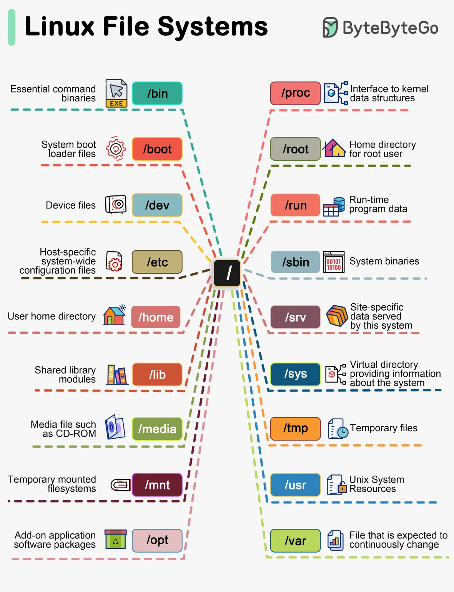

# Linux

📹 Must Watch: [Linux Crash Course for Beginners with Labs](https://www.youtube.com/watch?v=6WatcfENsOU) 🌟🌟🌟🌟🌟

### Learn linux from my Github repository - Click [here](https://github.com/abhi3700/My_Learning_Linux_essentials)

### Learn all the Linux commands from [here](https://github.com/abhi3700/My_Learning_Linux_essentials/blob/master/commands_all.md)
