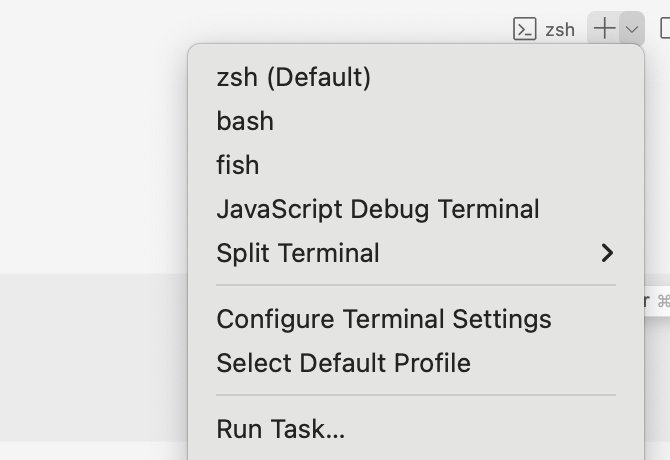
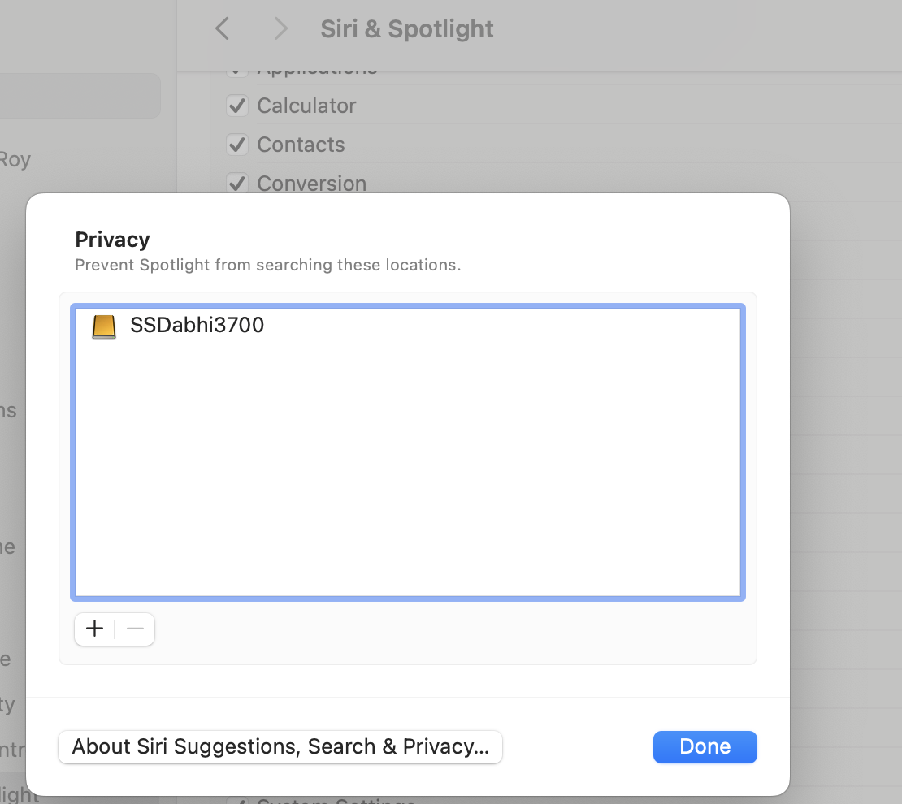

# MacOS for Windows users

```console
❯ sysctl -n machdep.cpu.brand_string
Apple M1 Max
```

---

Whether Hypervisor.framework is supported

```console
❯ sysctl kern.hv_support
kern.hv_support: 1
```

> If it is 1, then your CPU is supported.
> If it is 0, it means the Hypervisor.framework cannot be used with your CPU, for a reason or another.

```console
❯ sysctl -a | grep -o VMX                                                     ⏎
VMX
```

## Installation

System:

```

Processor: ARM/M1

```

### Migrate

- In order to migrate the data from old Macbook, just open "Migration Assistant" App on the 'To Macbook' & share all the OTP details with 'From Macbook'.
- Ensure "Xcode" App from Appstore. This is very useful for development.

### New Account

1. Like in case of windows, format C:\ drive (containing OS) & then install from scratch. Here, just create a new account (also give admin rights) from the existing (Admin) account,
2. And then switch to the new account created & delete the previous admin account.

## Package Manager/Homebrew

Select [Homebrew](https://brew.sh/) for installing libs, packages, tools on macOS.

> This is like `apt` (frequently used for Linux).

`brew` is installed at `/opt/homebrew` on M1, and `/usr/local` on Intel hardwares.

After installation, packages are installed into `/usr/local/Cellar/<package>` with binaries, symlinks into

| Hardware    | M1                                  | Intel                            |
| ----------- | ----------------------------------- | -------------------------------- |
| Binary      | `/opt/homebrew/bin`                 | `/usr/local/bin`                 |
| Library     | `/opt/homebrew/lib`                 | `/usr/local/lib`                 |
| Log         | `/opt/homebrew/var/log`             | `/usr/local/var/log`             |
| Data        | `/opt/homebrew/var`                 | `/usr/local/var`                 |
| Config file | `/opt/homebrew/etc/<filename.conf>` | `/usr/local/etc/<filename.conf>` |

### Commands

- `$ brew --prefix`: where `brew` is installed.
- `$ brew install <package-name>`: install the package
- `$ brew uninstall <package-name>`: uninstall the package
- `$ brew update`: update the package list
- `$ brew list`: list all the packages installed
- `$ brew list <package-name>`: check for the package if installed
- `$ brew info <package-name>`: give info about the package
- `$ brew services start <service-name>`: start services like `mysql`, `redis`, etc.
- `$ brew services restart <service-name>`: restart services like `mysql`, `redis`, etc.
- `$ brew services stop <service-name>`: stop services like `mysql`, `redis`, etc.
- `$ brew services list`: list all the services running (ever started) & their status like this:

  ```console
  ❯ brew services list                                                                                                                                                               ⏎
  Name              Status  User     File
  docker-machine    none
  mongodb-community started abhi3700 ~/Library/LaunchAgents/homebrew.mxcl.mongodb-community.plist
  mysql             started abhi3700 ~/Library/LaunchAgents/homebrew.mxcl.mysql.plist
  postgresql@11     none
  postgresql@14     none
  redis             none
  unbound           none
  ```

- `$ brew doctor --verbose`: check if brew is working fine or not.

## Architecture

> An Apple Silicon mac can run both the **Intel** and the **ARM64** portions of a universal binary application. But not the other way around. Intel binaries are emulated under **Rosetta 2** on Apple Silicon, but there is no emulation of **ARM64** on **Intel**-based mac. [Source](https://indiespark.top/programming/compile-open-ssl-apple-silicon/)
>
> The long-rumored ARM Mac is on the horizon. With this comes the big work of porting and re-compiling current applications. But many Mac App Store apps are dependent on **OpenSSL**, which doesn’t yet support **ARM** on the Mac. Here is how you can continue to test your mac app while waiting for official **OpenSSL** support for the new hardware.
>
> For installation of `openssl` (imp. for most Apps) in Mac M1 machine, follow [this](https://indiespark.top/programming/compile-open-ssl-apple-silicon/) guide.

There are 2 methods to use x86_64 architecture on Mac M1:

1. VMs like UTM (requires more local RAM), Parallels (requires cloud dependency, paid)
2. Switch from one arch to another in terminal

### 1. Virtual Machines/Emulator

More on this [here](https://github.com/abhi3700/my_coding_toolkit/blob/main/vm_all.md).

### 2. How to switch the Terminal between x86_64 and arm64

- Switch from one architecture to another in this way:

```console
❯ arch
arm64

❯ arm

❯ arch
arm64

❯ intel

❯ arch
i386
```

- Here, intel, arm is an alias which has been added in `~/.zshrc` file like this:

```
# switch to architectures - intel or m1
alias arm="env /usr/bin/arch -arm64 /bin/zsh --login"
alias intel="env /usr/bin/arch -x86_64 /bin/zsh --login"
```

- The command for switching to an architecture in Mac M1 is this: `$ env /usr/bin/arch -<architecture> /bin/zsh --login`

- We can also dedicate Refer this [error](https://github.com/abhi3700/my_coding_toolkit/blob/master/mac_for_win.md#3-unable-to-use-software-requiring-x86_64-architecture-on-m1-macbook) faced during one of the software installation

## Folders

- Root: `/`
- Drive: `/` i.e. Macintosh HD
- Temp: `/tmp`
- Home: `~` or `/Users/abhi3700`
- Desktop: `~/Desktop`
- Downloads: `~/Downloads`
- Users: `/Users`
- Me: `/Users/abhi3700`
- Applications: `/Applications`
- Library: `/Library`

### Update

- After updating, update the CLI tools using `xcode-select --install` in terminal.

## Glossary (Windows <--> macOS)

- Explorer <--> Finder
- Taskbar <--> Dock
- Action center <--> Notification Center
- `.exe` <--> `.dmg`
- Properties <--> Quick look
- Task Manager <--> Activity Monitor
- On mac, Spotlight: help you quickly find apps, documents, and other files on your Mac. It can be accessed via <kbd>cmd+spacebar</kbd>

## Keyboard shortcuts

| Mac       | Win       |
| --------- | --------- |
| cmd, ctrl | ctrl, win |
| opt       | alt       |

- <kbd>cmd+c</kbd>: copy
- <kbd>cmd+v</kbd>: paste
- <kbd>cmd+m</kbd>: minimize an opened windows
- <kbd>cmd+w</kbd>: close the App, but still open in background. ~ `ctrl+w`
- <kbd>cmd+q</kbd>: quit the App
- <kbd>cmd+[</kbd>: Go Back on browser
- <kbd>cmd+]</kbd>: Go Forward on browser ~ `backspace`
- <kbd>cmd+F3</kbd>: Show Desktop ~ `win+d`
- <kbd>cmd+shift+c</kbd>: Go to computer ~ `win+e`
  > NOTE: It won't work on browser. Rather it opens the console.
- <kbd>cmd+tab</kbd>: Go forward in opened applications ~ `alt+tab`
- <kbd>cmd+shift+tab</kbd>: Go backward in opened applications ~ `alt+shift+tab`
- <kbd>cmd+shift+n</kbd>: create a new folder at selected directory
- <kbd>opt+ <-</kbd>: skip to character after space ~ `ctrl+ <-`
- <kbd>opt+ -></kbd>: skip to character before space ~ `ctrl+ ->`
- <kbd>cmd+delete</kbd>: Temporarily delete a file i.e. shift to **Bin** ~ `shift+delete`
- <kbd>cmd+opt+delete</kbd>: permanently delete a file ~ `shift+delete`
- <kbd>cmd+shift+delete</kbd>: Empty bin
- open terminal in a finder at a location: open terminal >> type cd << drag the folder into the terminal >> enter
- <kbd>cmd+shift+3</kbd>: Full capture
- <kbd>cmd+shift+4</kbd>: Custom capture. To copy, press & hold the `control` key during the capture. And paste into wherever you want.
- <kbd>cmd+shift+5</kbd>: More features related to capture
- <kbd>ctrl+ <-</kbd>: Switch to workspace towards left ~ `ctrl+alt+ <-`
- <kbd>ctrl+ -></kbd>: Switch to workspace towards right ~ `ctrl+alt+ ->`
- <kbd>cmd+spacebar</kbd>: Open Spotlight menu which helps in searching anything
- <kbd>cmd+shift+spacebar</kbd>: Open Spotlight in the Finder
- Cut & Paste file:
  1. Copy <kbd>command+c</kbd>
  2. Paste with replacing the copied file <kbd>command+option+v</kbd>
- <kbd>cmd+`</kbd>: Switch to a window of an Application
- <kbd>ctrl+down</kbd>: show all opened windows of an App. Restore back by opening the current window via <kbd>control+up</kbd>
- <kbd>cmd+up</kbd>: Home
- <kbd>cmd+down</kbd>: End
- Add your own shortcut key using [this](https://apple.stackexchange.com/a/212607/435627)
- [custom] <kbd>ctrl+opt+leftarrow</kbd>: Tile to the left of the window
- [custom] <kbd>ctrl+opt+rightarrow</kbd>: Tile to the right of the window
- <kbd>cmd+opt+d</kbd>: Hide the dock (or taskbar in Windows)
- <kbd>cmd+shift+.</kbd>: Show/Hide the hidden files (starting with ., ).
- <kbd>cmd+t</kbd> on Finder creates a separate tab.
- <kbd>cmd+i</kbd>: Get info on an App i.e. basically right click >> Select "Get Info"
- <kbd>cmd+ctrl+f</kbd>: Go & Escape fullscreen for an App
- <kbd>cmd+down</kbd>: Open a file in finder
- <kbd>cmd+ctrl+spacebar</kbd>: Use emoji & symbols
- <kbd>cmd+ctrl+q</kbd>: lock screen
- <kbd>cmd+ctrl+opt+power</kbd>: Shut down (closing all apps)
- <kbd>cmd+shift+r</kbd>: quickly access airdrop
- <kbd>cmd+opt+n</kbd>: show/hide the widget panel on right side of screen
- <kbd>cmd+opt+d</kbd>: show/hide the dock (bar below)
- <kbd>ctrl+e</kbd>: Show the cursor to the end of the line
- <kbd>opt+shift+F12/F11</kbd>: Increase/Decrease volume by small steps (i.e. 4 steps per box/division). Otherwise, if only F11/F12 keys used, it increases by 1 box.

## Installation

- Install:
  - M-1: Go to App store, then press `GET` to install.
  - M-2: From internet download the file (`.dgm` preferrred) >> install >> drag & drop to "Applications"
- Uninstall:
  - Go to "Finder", search for App >> drag & drop the App to "Bin"

## Apps

- **Numbers**: a quick analysis app like Excel for data analytics.
- **Pages**: a document app like Word, but with PPT type of styling. Easy to add cards, etc.
- **Notes**: a note app for maintaining TODO list
  - <kbd>cmd+opt+n</kbd>: show/hide folders
- **Freeform**: whiteboard app like Miro [FREE for macOS]
- **Miro**: Architecture, Mind Map, Whiteboard [PAID]
- **Draw.io**: Architecture, Mind Map, Whiteboard [FREE]
- **Visual Studio Code (VSC)**: Global code editor
- **Virtual Machine (VM)**: For any VM setup, refer [this](https://github.com/abhi3700/my_coding_toolkit/blob/master/vm_all.md).
  - GUI (UTM)
  - CLI (lima)
- **Handbrake**: File compressor
- **Photo Booth**: Capture Image, Video
- **Facetime**: Call someone
- **OBS** (FREE): Screen recorder with/without camera
- **Movavi Video Suite 23** (purchased license)
- **Fork** (purchased license): Git GUI
- **Screen recorder**: <kbd>cmd+shift+5</kbd>
- **[Warp](https://www.warp.dev/)**: Rust-based Terminal for any OS (Windows, Linux, Mac). It's fast & has a lot of features (AI suggestion) & customizations, notifications, etc unlike default `Terminal` app.
  - Open from VSCode:
    1. Go to Preferences using <kbd>cmd+,</kbd>.
    2. Search for "terminal" & then in "Terminal > External: Osx Exec", replace `Terminal.app` with `Warp.app`.
    3. Just press <kbd>cmd+shift+c</kbd> to open **Warp** app at the workspace directory. Each time you press the shortcut key, it opens new session in Warp terminal app.
  - Setup hotkey:
    - Go to Warp settings, then press any shortcut key for instance, <kbd>ctrl+shift+t</kbd>.
    - Now, Warp opens from any other app on macOS using this shortcut key. Usage: from VSCode editor.
  - Setup default editor to VSCode in Warp settings.

## Display

- Night light/effect: "System Preferences" >> Displays >> Night Shift >> Schedule: On, Manual
- Resolution: Choose 2nd i.e. `1280 x 800`

## Touchpad

> Touchpad settings can be changed.

- three touch towards up: Show all the opened apps & also create new workspace or switch to a workspace.
- Single clicked with 2 fingers on the touchpad ~ `Right click` on Windows.
- zoom level:
  - 2 fingers wide apart: zoom in
  - 2 fingers close in: zoom out
- zoom level using modifier key (works on every App):
  - hold the `cmd` (custom set) key pressed, then use 2 fingers together in 1-direction (scroll up/down) to zoom in/out
    

## Browser (chrome-based)

### Shortcut keys

- <kbd>cmd+opt+leftarrow</kbd>: switch to left tab
- <kbd>cmd+opt+rightarrow</kbd>: switch to right tab
- <kbd>cmd+w</kbd>: close tab
- <kbd>cmd+shift+a</kbd>: Search tabs
- <kbd>cmd+shift+w</kbd>: close window
- <kbd>cmd+opt+j</kbd>: Open console for current browser tab
- <kbd>cmd+shift+m</kbd>: View profiles & then ⬇⬆ to go up/down the profile & then <kbd>enter</kbd> to switch

### Extensions

- [Screenshot YouTube](https://chrome.google.com/webstore/detail/screenshot-youtube/gjoijpfmdhbjkkgnmahganhoinjjpohk/related?hl=en)

## Terminal/CLI

View all your terminals (`bash`, `zsh`, `fish`, ..) in VSCode (or Cursor).
> This is helpful when you want to use `zsh` instead of `fish` because let's say it doesn't support few things or during exporting few vars like `$PATH` to terminal with new variant.



---

Prefer `fish` instead of `zsh`.

~~Prefer `zsh` instead of `bash`~~.

> Correspondingly, use `~/.zshrc`, `~/.zprofile` instead of `~/.bashrc`, `~/.bash_profile` file.

Use `profile` suffixed file for adding additional command during toolkit installation.

To know which one is being used now:

```sh
❯ echo $0
-zsh
```

Read [more](https://shreevatsa.wordpress.com/2008/03/30/zshbash-startup-files-loading-order-bashrc-zshrc-etc/).

### Shortcut keys

- <kbd>ctrl+l</kbd>: clear the console
- <kbd>cmd+l</kbd>: clear console by 1 command
- <kbd>cmd+w</kbd>: close the current terminal
- <kbd>cmd+t</kbd>: open a new tab at the current directory
- <kbd>ctrl+w</kbd>: backspace word by word
- <kbd>ctrl+q</kbd>: clear the entire command/sentence
- <kbd>ctrl+d</kbd>: logout from different setup like `colima`, or any VM or `python3`, etc..

### Commands

- `$ open .`: open the Finder in the directory
- Run `.sh` file: `sh /path/to/file/with/extension`
- `$ which <command>`: gives the location of the command file
- open any application from terminal: `$ open -a <executable_dir>` E.g. `open -a /Applications/Visual\ Studio\ Code.app`
- `$ tar -xf boost-1.78.0.tar.gz`: unzip a folder via terminal
- `$ env`: all the global variables. can be used like this `$ echo $NVM_DIR` -> `/Users/abhi3700/.nvm`
- `$ lsof -i:<PORT_NO>`: Check if a port is open. E.g. `lsof -i:3000`
- `$ kill <PID>`: kill a process running on a port: E.g. `kill 4534`
- `open -n -a Terminal <path>`: open a new terminal window at the given path (optional).
- `date -ur <timestamp>`: `Get UTC human-readable datetime from UNIX timestamp
- `date -j -d %s <timestamp>`: `Get IST human-readable datetime from UNIX timestamp
- `dx -sh <FOLDER-NAME>`: Get folder size.
- `sudo lsof -i :<PORT_NO>`: Show the process running on a given port.
  > Get the PID from 🔝.
- `sudo kill -9 <PID>`: Kill the process running on a port via PID

---

Types:

`bash`

```sh
$ which bash
/bin/bash
```

---

`zsh` (I use)

```sh
$ which zsh
/opt/homebrew/bin/zsh
```

---

installed bin paths of `zsh`:

```sh
$ where zsh
/opt/homebrew/bin/zsh
/opt/homebrew/bin/zsh
/opt/homebrew/bin/zsh
/bin/zsh
```

---

Change from `zsh` to `bash`: `❯ chsh -s /bin/bash $USER`

Find which one is being used on Linux/Mac:

```sh
$ echo $0
-zsh
```

```sh
$ echo $0
/bin/bash
```

---

Find which version of bash/zsh being used on Linux/Mac:

```sh
$ bash --version
GNU bash, version 3.2.57(1)-release (arm64-apple-darwin21)
Copyright (C) 2007 Free Software Foundation, Inc.
```

```sh
$ zsh --version
zsh 5.9 (arm-apple-darwin21.3.0)
```

---

How to convert from hex to decimal & vice-versa:

```sh
h2d(){
  echo "ibase=16; $@"|bc
}
d2h(){
  echo "obase=16; $@"|bc
}
o2d(){
  echo "ibase=8; $@"|bc
}
d2o(){
  echo "obase=8; $@"|bc
}
b2d(){
  echo "ibase=2; $@"|bc
}
d2b(){
  echo "obase=2; $@"|bc
}
```

Example:

```sh
❯ h2d 0x1f
31
```

Just add this to `~/.zprofile` (if using `zsh`). Then, run `source ~/.zprofile` to reflect the changes.

### PATH

- Stored in `/etc/profile`
- Add current directory to the PATH:
  - Open the file in ST editor, `$ subl ~/.zprofile`.
  - add this line `export PATH=$PWD/bin:$PATH` to the End of File (EOF). If a specific directory, then `export PATH=<custom-directory>:$PATH` e.g. `export PATH="/Users/abhi3700/Desktop/solana-1.8.5/bin:$PATH"`
  - Run this to activate `$ source ~/.zprofile`
  - Now, use the command in the current/new terminal.

### Beautify

#### 1. Preparation

Recommend to install homebrew first:

`/usr/bin/ruby -e "$(curl -fsSL https://raw.githubusercontent.com/Homebrew/install/master/install)"`

Install zsh if you are on macOS version prior to Catalina:

- Install zsh `brew install zsh`
- Set zsh as your default shell `chsh -s /usr/local/bin/zsh`

#### 2. Install oh-my-zsh

- `sh -c "$(curl -fsSL https://raw.github.com/robbyrussell/oh-my-zsh/master/tools/install.sh)"`

#### 3. Install oh-my-zsh theme & must-have plugins

- config `.zshrc` (present in `~` location)
- open via `nano ~/.zshrc` & set these
- Set `ZSH_THEME` to your favorite theme name (preferred `intheloop`). Select from [link1](https://github.com/ohmyzsh/ohmyzsh/wiki/Themes), [link2](https://github.com/ohmyzsh/ohmyzsh/wiki/External-themes)
- must-have plugins

```
plugins=(
  git
  extract
  autojump
  zsh-autosuggestions
  zsh-syntax-highlighting
)
```

### Fish

Current situation:

- You have a successful Terminal app running with `zsh` enabled. Well in order to use auto completions based on your history & access modern features, use **Fish** instead.
- So, effectively you are on `zsh` terminal (on top of factory reset Apple's terminal app). Now, you are planning to change it to `fish`.

Installation:

1. Open your Terminal app, run `$ brew install fish` to install fish.
2. Get the `fish` path,

```sh
which fish
/opt/homebrew/bin/fish
```

3. Add fish to shells list:

```sh
echo /opt/homebrew/bin/fish | sudo tee -a /etc/shells
```

4. Change the shell to fish by default so that when a new terminal tab/window opened, it redirects me to `fish` shell just like previously `zsh`.

```sh
chsh -s /opt/homebrew/bin/fish
```

5. Now, you have to copy the `zsh`'s `$PATH` variable (has previously installed bin PATHs) into that of `fish`.

```sh
echo $PATH
...
...
```

6. Paste into fish's config file using `nano` command:

```sh
nano ~/.config/fish/config.fish
```

7. Add that line here (wouldn't be wrapped).

```sh
set -gx PATH <paste-your-PATH-here>
```

DONE! 🎉

---

You can also revert back from `fish` to `zsh`:

1. Make sure `zsh` is present in your shells list. Verify:

```sh
cat /etc/shells
```

2. [OPTIONAL] If not available, add its path to shells list.

```sh
$ which zsh
/opt/homebrew/bin/zsh

$ echo /opt/homebrew/bin/zsh | sudo tee -a /etc/shells
```

3. Change shell back to `zsh`.

```sh
chsh -s /opt/homebrew/bin/zsh
```

DONE! 🎉

## How-to

- [Force Shutdown using Key](https://www.youtube.com/watch?v=ePhnDneb19M)
- Hibernate: Go to Apple icon >> Shutdown >> tick the "Reopen the windows..." >> Press shutdown button.
- [Prevent indexing of a particular directory](#7-indexing-is-stuck-on-spotlight)

## Troubleshoot

### 1. Error: 'This Apple ID has not yet been used with the App Store'

- **Reason**: This error occurs after login into "App Store" >> press Review button >> Error >> Again login >> Review >> Error .....likewise infinite times.
- **Solution**: Open "Apple Music" App. Go to Account on the top >> Login using Apple ID >> Set the payment (as None or other method) & billing address >> Done.

### 2. Unable to run unverified App

1. Open **Finder**
1. Search for the App
1. Select and `ctrl+click (on touchpad)` >> open
1. Thereafter, it's added into the list of unverified Apps & it will automatically open just like other verified Apps.

### 3. Unable to use Software requiring x86_64 architecture on M1 Macbook

- Below is the error for `eosio` installation

```

eosio: The intel architecture is required for this software.
Error: An unsatisifed requirement failed this build.

```

- Solution: Follow [this](https://benobi.one/posts/running_brew_on_m1_for_x86/)
  - Install Rosetta (this will fail if your Terminal is set to “Open using Rosetta") by running: `$ softwareupdate --install-rose`
  - Run this command to install the Intel architecture Homebrew: `$ arch -x86_64 /bin/bash -c "$(curl -fsSL https://raw.githubusercontent.com/Homebrew/install/master/install.sh)"`
  - Add this to your ZSH config (I recommend using OhMyZSH + add a file called `~/.oh-my-zsh/custom/brew.zsh`) with the contents:
    - create `.../brew.zsh` using `$ touch ~/.oh-my-zsh/custom/brew.zsh`

  ```

  export PATH="/opt/homebrew/bin:/usr/local/bin:$PATH"
  alias ibrew='arch -x86_64 /usr/local/bin/brew'

  ```

  - Re-source your zsh term `$ source ~/.zshrc`
  - Run Intel brew as `$ ibrew install <whatever>`
  - Now, create a new terminal by following these: [Source](https://medium.com/swlh/run-x86-terminal-apps-like-homebrew-on-your-new-m1-mac-73bdc9b0f343)
    - Open Finder and navigate to `Applications -> Utilities`
    - Right-click on the `Terminal` app and choose `Duplicate`
    - Rename your newly duplicated Terminal app something special like `Terminal-Rosetta`
    - Right-click the `Terminal-Rosetta` app and click on `Get Info`
    - Select the option to `Open using Rosetta`
    - You can now use `Terminal-Rosetta` to install and run Homebrew and any other x86 command-line apps just as you did back in the day 👏

### 4. Error: xcrun: error: invalid active developer path

- **Reason**: After updating MacOS, the CLI needs to be updated.
- **Solution**: Run `xcode-select --install` in terminal.

### 5. The command is not activated even after `export PATH=$PWD/bin:$PATH`

- **Reason**: the command is not mentioned into the `~/.zprofile`
- **Solution**:
  - Open the file in ST editor, `$ subl ~/.zprofile`.
  - add this line `export PATH=$PWD/bin:$PATH` to the End of File (EOF).
  - Run this to activate `$ source ~/.zprofile`
  - Now, use the command in the current/new terminal.

### 6. Git install repeatedly fails after Mac Update

- **Reason**: Unknown
- **Solution**: `$ sudo xcode-select -switch /Library/Developer/CommandLineTools`

### 7. Indexing is stuck on spotlight

- **Reason**: May be because it is indexing external drives (HDD/SSD).
- **Solution**: "System Settings" >> "Siri & Spotlight" in sidebar >> "Spotlight Privacy":
  - <u>Exclude files in a folder or disk from Spotlight searches</u>: Click the Add button ➕, then select a folder or disk. You can also drag folders or disks into the field.
  - <u>Include excluded files in folders or disks in Spotlight searches</u>: Select the folder or disk in the list, then click the Remove button ➖.
  

  Now, restart your computer to enable indexing with updated folders settings. 🎉

## References

- Apple keyboard shortcuts - <https://support.apple.com/en-in/HT201236>
- Apple Q & A - <https://apple.stackexchange.com/>
