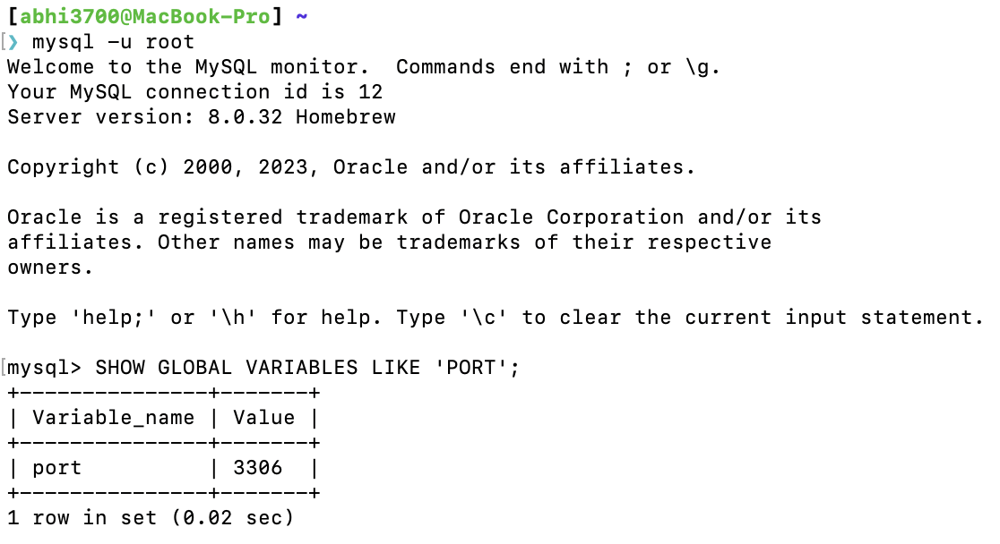
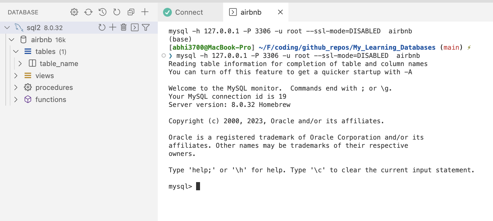
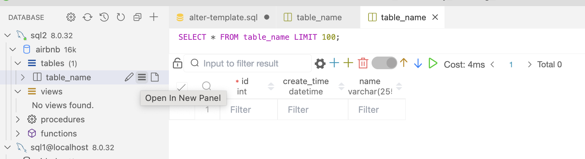
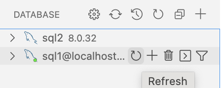
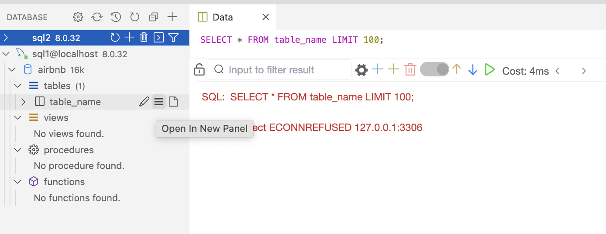
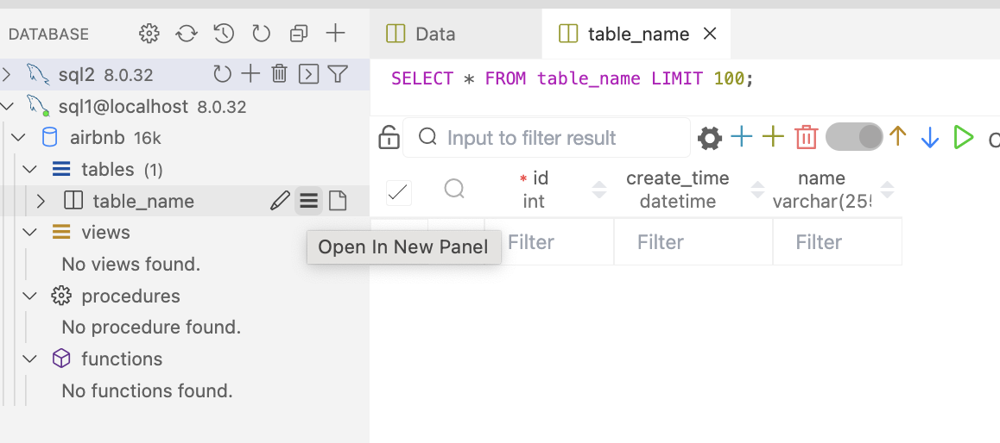
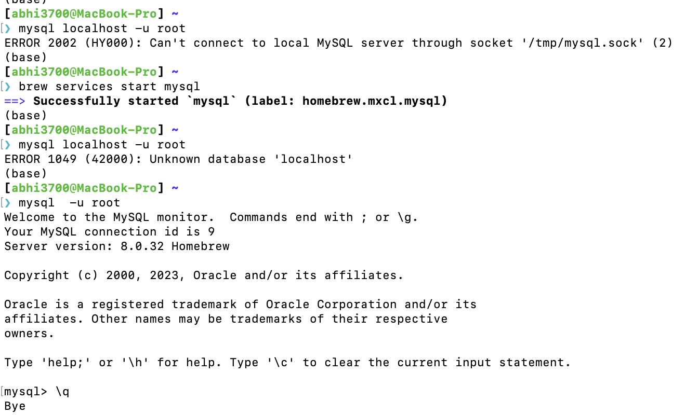

# SQL

Learn everything about SQL

## Overview/Summary

This can be considered as a summary.

- In SQL DB, we have columns and rows, where `fields` -> `columns` and `records` -> `rows`.
- In order to run SQL service (as a server), we need to install `mysql` server locally, which is possible via `$ brew install mysql` command on macOS.
- In order to view database, we need to install a client tool, for which we prefer using

  - ✅ VSCode extension: [**Database Client**](https://marketplace.visualstudio.com/items?itemName=cweijan.vscode-database-client2) (has all types of database support).
  - ✅ We can use `mysql` CLI command as client tool like list all ports running SQL services like in SQL query syntax:

    ```console
    ❯ mysql -u root
    Welcome to the MySQL monitor.  Commands end with ; or \g.
    Your MySQL connection id is 12
    Server version: 8.0.32 Homebrew

    Copyright (c) 2000, 2023, Oracle and/or its affiliates.

    Oracle is a registered trademark of Oracle Corporation and/or its
    affiliates. Other names may be trademarks of their respective
    owners.

    Type 'help;' or '\h' for help. Type '\c' to clear the current input statement.

    mysql> SHOW GLOBAL VARIABLES LIKE 'PORT';
    +---------------+-------+
    | Variable_name | Value |
    +---------------+-------+
    | port          | 3306  |
    +---------------+-------+
    1 row in set (0.02 sec)

    mysql>
    ```

- ❌ Installing `mysql-client` was a failure in my case, in terms of library linking due to conflicts in name.
- Whenever, any table is viewed/opened or queried, it is done via the internal shell of `mysql` server, provided the connection is established.
- The connection is established on CLI via `$ brew services start mysql`
  > If the connection has some issues, then we can check the logs via `$ brew services log mysql` or restart the service via `$ brew services restart mysql`
- And the testing/usage is done, we can close the connection via `$ brew services stop mysql`

## Installation

> macOS M1

1. `$ brew install mysql`

   ```console
   We've installed your MySQL database without a root password. To secure it run:
       mysql_secure_installation

   MySQL is configured to only allow connections from localhost by default

   To connect run:
       mysql -u root

   To start mysql now and restart at login:
     brew services start mysql
   ==> Summary
   🍺  /opt/homebrew/Cellar/mysql/8.0.32: 317 files, 298.2MB
   ==> Running `brew cleanup mysql`...
   Disable this behaviour by setting HOMEBREW_NO_INSTALL_CLEANUP.
   Hide these hints with HOMEBREW_NO_ENV_HINTS (see `man brew`).
   ==> Caveats
   ==> mysql
   We've installed your MySQL database without a root password. To secure it run:
       mysql_secure_installation

   MySQL is configured to only allow connections from localhost by default

   To connect run:
       mysql -u root

   To start mysql now and restart at login:
     brew services start mysql
   ```

   > By default, there is no password attached to `root` user in `mysql`, but we can set it via `$ mysql_secure_installation` command.

2. `$ brew services restart mysql` [RECOMMENDED] or `$ mysql.server start`

   > A folder named `mysql` will be created in `/opt/homebrew/var/`
   >
   > Also, `mysqld_safe` starts running in background

   ```console
   Stopping `mysql`... (might take a while)
   ==> Successfully stopped `mysql` (label: homebrew.mxcl.mysql)
   ==> Successfully started `mysql` (label: homebrew.mxcl.mysql)
   ```

3. [OPTIONAL] `$ mysql_secure_installation`: to set/change the password for `root` user.

   > When run for 1st time after installation, it will ask for password strength type (low/medium/high).

   the required files are saved in `/opt/homebrew/var/` folder.

## Uninstallation

> Takes sometime honestly...so be patient

1. stop the ongoing mysql services via `$ brew services stop mysql`
2. `$ ❯ brew uninstall --force mysql`

   ```console
   Uninstalling mysql... (317 files, 298.2MB)`
   ```

   Verify it is uninstalled:

   ```console
   ❯ mysql
   zsh: command not found: mysql
   ```

   Also `mysql` folder is deleted from this locations: `/opt/homebrew/Cellar/`, `/opt/homebrew/var/`

## Commands

- To set validate password component, password for root user via `$ mysql_secure_installation`
- To start/restart/stop mysql server via `$ brew services start mysql` or `$ brew services restart mysql` or `$ brew services stop mysql`
- To connect to `root` user

  ```console
  $ mysql -u root -p

  # OR

  $ mysql --user=root --password
  ```

- To start mysql now and restart at login via `$ brew services start mysql` or `$ brew services restart mysql`
- change `root` user password via `ALTER ....` command inside `mysql` shell

  ```console
  $ mysql --user=root --password                                                                                                                                 ⏎
  Enter password:
  Welcome to the MySQL monitor.  Commands end with ; or \g.
  Your MySQL connection id is 14
  Server version: 8.0.32 Homebrew

  Copyright (c) 2000, 2023, Oracle and/or its affiliates.

  Oracle is a registered trademark of Oracle Corporation and/or its
  affiliates. Other names may be trademarks of their respective
  owners.

  Type 'help;' or '\h' for help. Type '\c' to clear the current input statement.

  mysql> ALTER USER 'root'@'localhost' IDENTIFIED WITH mysql_native_password BY 'Password@123';
  Query OK, 0 rows affected (0.00 sec)

  mysql> \q
  Bye
  ```

- List all the ports running SQL services:
  

## Usage

> For testing purpose, no need to setup any password. If you want to setup password for `root` user, then just use `$ mysql_secure_installation` command.
>
> It would first ask for "VALIDATE PASSWORD COMPONENT" like this:

```console
VALIDATE PASSWORD COMPONENT can be used to test passwords
and improve security. It checks the strength of password
and allows the users to set only those passwords which are
secure enough. Would you like to setup VALIDATE PASSWORD component?

Press y|Y for Yes, any other key for No: y

There are three levels of password validation policy:

LOW    Length >= 8
MEDIUM Length >= 8, numeric, mixed case, and special characters
STRONG Length >= 8, numeric, mixed case, special characters and dictionary                  file

Please enter 0 = LOW, 1 = MEDIUM and 2 = STRONG: n
```

---

Create a connection to `mysql` server via extension in VSCode.

---

Whenever, we click the <kbd>></kbd> on the extension,



it basically runs the following command:

```console
$ mysql -h 127.0.0.1 -P 3306 -u root --ssl-mode=DISABLED  airbnb on terminal
```

> Here, no password is required as it's not set via `$ mysql_secure_installation` command.

And thereafter whatever query we do, it runs in the internal opened shell.

---

Open `table_name` in a new panel like this:



Here, SQL query language can be edited.

---

When 2 instances are given same localhost @ port number, then only 1 instance can be connected to that port number.



Here, the green color shows that 2nd instance is connected to the `mysql` server.

---

If server is stopped via `$ brew services stop mysql`, then the connection is lost.

Hence, when we want to open the table in a new panel, it shows the following error:

`Error: connect ECONNREFUSED 127.0.0.1:3306`



---

Now, after running the command `$ brew services start mysql`, the connection is established again.

Hence, when table is again opened in a new panel, it shows the following:



## Troubleshooting

### 1. ERROR 2002 (HY000): Can't connect to local MySQL server through socket '/tmp/mysql.sock' (2)

- _Cause_: The MySQL server is not running.
- _Solution_: Just establish a connection via `$ brew services start mysql`


